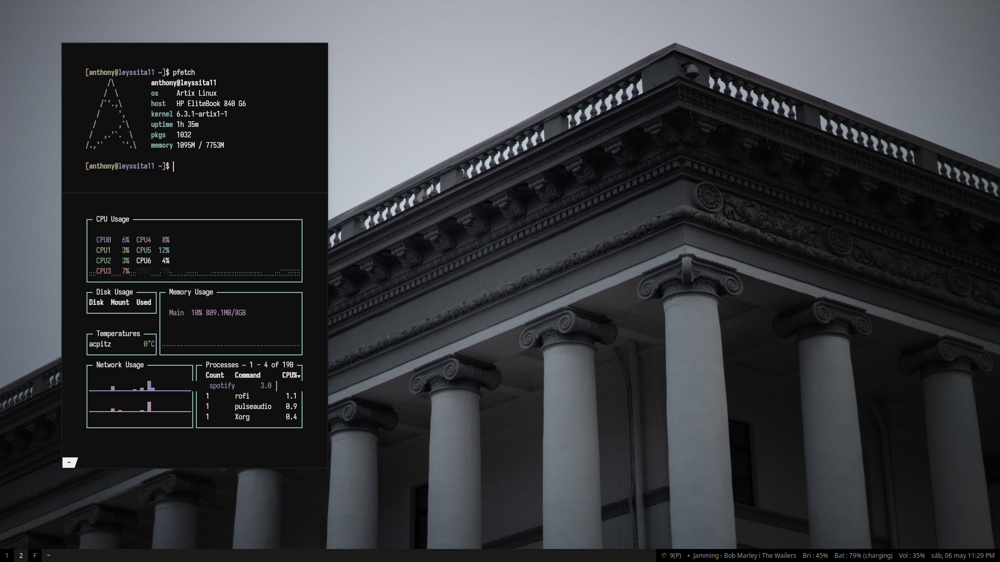

Dotfiles is the collection of configuration files and shell scripts.
for the programs I use daily on my linux machine. I use artix linux with runit as init system, also kde plasma and dwm my HP EliteBook 840 G6 laptop

